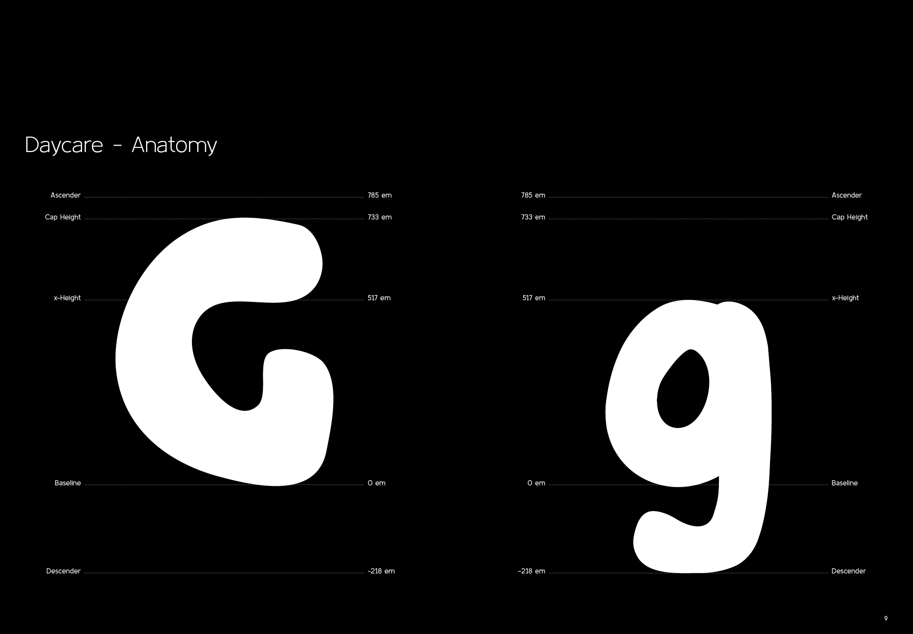
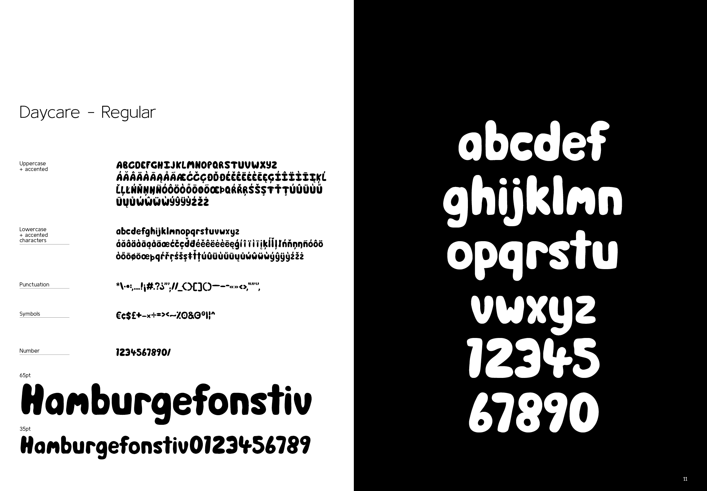
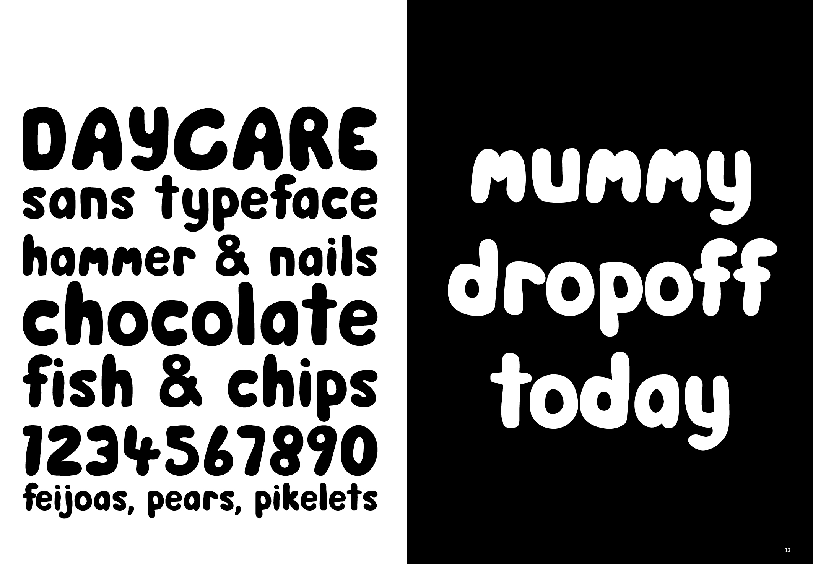
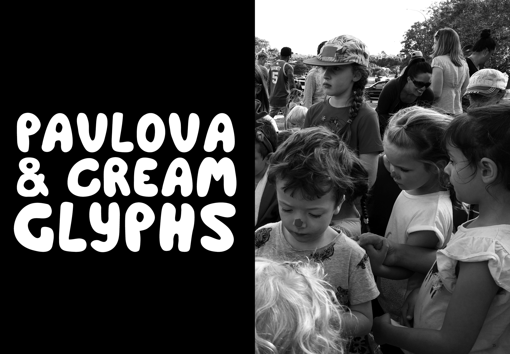

# Daycare

Daycare is an irregular, childlike, humanist sans serif display typeface.

Daycare is situated at my son's now ex childcare centre and represents a psychogeographical and emotive response to this place.

### Project documentation
Daycare is part of a larger series of site specific typefaces completed as part of a masters project. Further details regarding this typefaces development are available here, [Project overview](docs/project-overview.md).

### Available weights
Regular    

